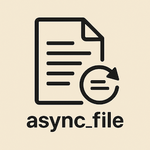

# async_file

Asynchronous file I/O operations with priority handling.



`async_file` provides a simple yet powerful API for performing asynchronous file operations
in Rust. It closely follows the standard library's file API design while adding async
support and priority-based scheduling.

## Features

* **Async Operations**: All file operations are asynchronous, allowing for non-blocking I/O
* **Priority Scheduling**: Every operation accepts a priority parameter for fine-grained control
* **Memory Safety**: Uses an opaque `Data` type to safely handle OS-managed memory allocations
* **Platform Agnostic**: Backend-agnostic API with a default std implementation

## Quick Start

```rust
use async_file::{File, Priority};

// Open a file with unit test priority
let file = File::open("/dev/zero", Priority::unit_test()).await?;

// Read up to 1KB of data
let data = file.read(1024, Priority::unit_test()).await?;
println!("Read {} bytes", data.len());
```

## Architecture Overview

### Opaque Type Design

The library uses opaque wrapper types that hide platform-specific implementations:

- `File`: Wraps platform file handles behind a unified async interface
- `Data`: Encapsulates OS-managed memory buffers for safe async I/O
- `Metadata`: Provides file information in a platform-agnostic way
- `Error`: Wraps platform-specific error types

This design ensures API stability while allowing platform-specific optimizations.

### Single Operation Constraint

**Important**: Only one operation may be in-flight at a time per file handle.

This constraint:
- Prevents race conditions on file position
- Simplifies the implementation
- Avoids many classes of concurrency bugs
- Matches typical file I/O patterns

Attempting concurrent operations on the same file handle will result in undefined behavior.

### Memory Management Strategy

The library uses an opaque `Data` type instead of user-provided buffers. This design:

- **Prevents use-after-free bugs**: If an async operation is cancelled (by dropping the
  future), the OS might still write to the buffer. OS-managed allocation prevents this.
- **Enables platform optimizations**: Different platforms can use their optimal memory
  allocation strategies.
- **Simplifies the API**: Users don't need to manage buffer lifetimes across await points.

## Common Usage Patterns

### Reading a File Completely

```rust
use async_file::{File, Priority};

// For small files, use read_all()
let file = File::open("config.txt", Priority::highest_async()).await?;
let contents = file.read_all(Priority::highest_async()).await?;

// Convert to String if needed
let text = String::from_utf8(contents.into_boxed_slice().into_vec())
    .expect("Invalid UTF-8");
```

### Sequential Reading with Seeking

```rust
use async_file::{File, Priority};
use std::io::SeekFrom;

let mut file = File::open("/dev/zero", Priority::unit_test()).await?;

// Read header (first 128 bytes)
let header = file.read(128, Priority::unit_test()).await?;

// Skip to data section at byte 1024
file.seek(SeekFrom::Start(1024), Priority::unit_test()).await?;
let data = file.read(512, Priority::unit_test()).await?;
```

### Checking File Existence

```rust
use async_file::{exists, File, Priority};

// Check if file exists before opening
if exists("/path/to/config", Priority::unit_test()).await {
    let file = File::open("/path/to/config", Priority::unit_test()).await?;
    // ... use file
}
```

### Priority-Based Operations

```rust
use async_file::{File, Priority};

// High priority for critical operations
let file = File::open("/critical/data", Priority::highest_async()).await?;
let data = file.read(1024, Priority::highest_async()).await?;

// Unit test priority for testing
let test_file = File::open("/dev/zero", Priority::unit_test()).await?;
let test_data = test_file.read(100, Priority::unit_test()).await?;
```

## API Overview

### File Operations

```rust
use async_file::{File, Priority};
use std::io::SeekFrom;

// Open a file
let mut file = File::open("/path/to/file", Priority::unit_test()).await?;

// Read data
let data = file.read(1024, Priority::unit_test()).await?;

// Seek to position
let pos = file.seek(SeekFrom::Start(100), Priority::unit_test()).await?;

// Get metadata
let metadata = file.metadata(Priority::unit_test()).await?;
println!("File size: {} bytes", metadata.len());

// Read entire file
let contents = file.read_all(Priority::unit_test()).await?;
```

### Memory Management

The `Data` type provides safe access to OS-managed memory:

```rust
let data = file.read(100, Priority::unit_test()).await?;

// Access as a slice
let bytes: &[u8] = data.as_ref();

// Convert to owned data (may require copying)
let boxed: Box<[u8]> = data.into_boxed_slice();
```

### Utility Functions

```rust
// Check if a file exists
let exists = async_file::exists("/path/to/file", Priority::unit_test()).await;

// Configure default origin for relative paths
async_file::set_default_origin("/base/path");
```

## Priority System

All operations require a priority parameter from the `priority` crate for scheduling control:

```rust
use async_file::Priority;

// Different priority levels
let high_priority = Priority::highest_async();
let test_priority = Priority::unit_test();
```

## License

Licensed under either of

 * Apache License, Version 2.0
   ([LICENSE-APACHE](LICENSE-APACHE.md) or http://www.apache.org/licenses/LICENSE-2.0)
 * MIT license
   ([LICENSE-MIT](LICENSE-MIT.md) or http://opensource.org/licenses/MIT)

at your option.